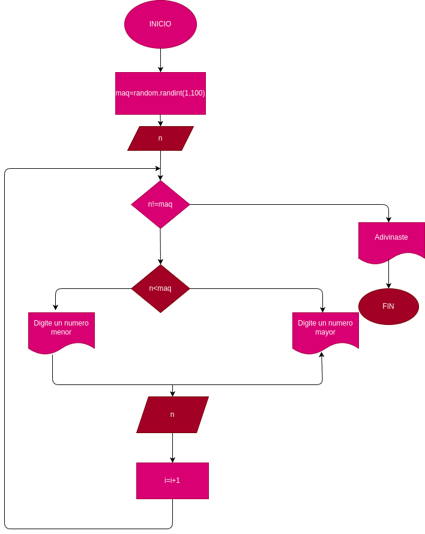

# Adivina_el_Numero
Programa para divinar un numero entre 1 y 100

# Analisis 

## Input
### Variables de entrada
z: Numero aleatorio 
n: digita el primer numero
### Processing
z=randing(1,100)

### output
z
# Diseño

# Construccion
